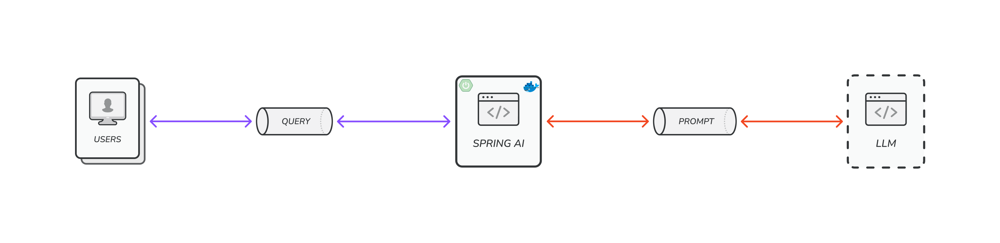
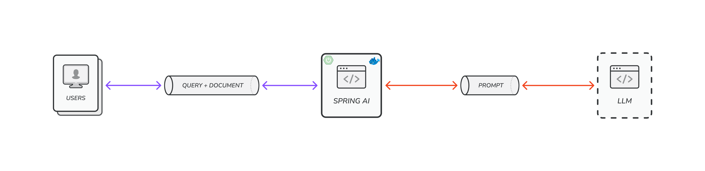

# Spring AI


## Getting started

> The project is packaged into docker images.
> In this case you must install Docker on your environment to start the application.
> To run the project, please run the command below.

```shell
sudo sh start.sh
```

> ❗️Note: Must create your own api keys for the Ai models.
> Currently, OpenApi and Anthropic(Claude) api keys must be defined in the environment file.

## Ai Chatbot



> I have created a simple Ai chatbot using multiple models.
> In future release I will be adding more models to the service.

## Image Generator

> Along with the chatbot, I have implemented an image generator.

## Advisor


> I have put together a Financial Advisor as an example. 
> But it can be converted to other types of advisor depends on the document you ingest to the vector database. 

### RAG - Retrieval Augmented Generation

> It combines 'Retrieval-based Methods' with 'Generative Models' to produce more accurate and contextually relevant
> outputs.
> In other words, it allows LLMs to access external knowledge sources, mitigating limitations like outdated information
> or knowledge cutoff

### Not RAG



> When without the RAG, the user fetches all of his/her documents along with the query.
> Sending al of the documents which some part of them are not relevant to the user query is not efficient and accurate.
